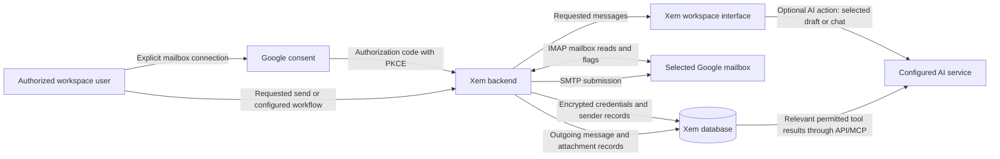

# Google mailbox verification and release checklist

Status: public hosted availability is gated. Code tests, a configured OAuth client, or a successful authorization URL do not constitute Google approval. Keep `GOOGLE_MAIL_ACCESS=testing` until all applicable external review is complete.

## Scope justification draft

The user-facing connector has two core purposes: **send email through SMTP** and **receive/read email through IMAP**. Ordinary Google sign-in is separate, and mailbox connection does not automatically invoke AI. Do not present unrelated Google products, organization-wide delegation or an inbox backup service as reasons for consent.

Suggested form text, accurately describing the current implementation:

> Xem is an email client. A user explicitly connects a Gmail or Google Workspace mailbox for two purposes: sending messages and replies using Google SMTP, and receiving, browsing, searching and reading messages and attachments using Google IMAP. Users can also change read/star flags. The connected sender may be selected in user-configured sending workflows, subject to Google limits and anti-spam policies. Mailbox access is shared with the user's Xem workspace under its existing permissions; administrators see this disclosure before connecting. Mailbox connection is separate from ordinary Google sign-in. Credentials remain on the backend and are encrypted at rest. Incoming mail is fetched on demand; outgoing messages and attachments are stored for the outbox and sending workflow. Connecting does not automatically process the inbox with AI. If users deliberately invoke AI writing or assistant tools, the selected draft and relevant workspace data may reach the configured AI service under the disclosed data policy.

The implementation uses Google's documented IMAP/SMTP XOAUTH2 protocol. That protocol requires `https://mail.google.com/`. Gmail API scopes such as `gmail.readonly` and `gmail.send` cannot authenticate this IMAP/SMTP implementation. Xem uses the Gmail profile endpoint to verify the authorized mailbox address. Mailbox OAuth is separate from ordinary Google sign-in, and the mailbox tokens stay on the backend.

### Scope review is unresolved

Google's XOAUTH2 documentation also says: "To be approved, your app must show full utilization of https://mail.google.com/. If your app does not require https://mail.google.com/, migrate to the Gmail API and use more granular restricted scopes."

Protocol compatibility describes the current implementation; it does **not** prove minimum required access. Xem does not implement permanent deletion/expunge. Do not claim it does, or add destructive features merely to justify a scope. Do not submit a "full utilization" attestation based only on SMTP/IMAP compatibility.

The recommended path if Google requires narrower access is a Google-specific Gmail API adapter while retaining generic IMAP/SMTP for other providers. `gmail.modify` is a candidate for the existing read, flag-change and send operations; confirm every method against the current scope reference. A send-only product mode could use `gmail.send`, but that is not an implemented mode today. Changing a scope string alone would break XOAUTH2 and is not a migration. The narrower adapter would require new message/label pagination, UID replacement, attachment/reply handling, refresh, consent and regression tests. It would still use restricted data and would not remove the hosted assessment requirement.

Use the email-client category matching the two core purposes. Review any automation/productivity category against the actual scheduled sending features and demonstrate them if in review scope. Remove unrelated backup, reporting, or monitoring categories only after confirming they are not used by other clients in the same project. Do not remove existing sign-in scopes or other clients without checking their use.

## Website and branding packet

The website now contains review drafts at `/privacy`, `/data-deletion` and `/google-mail`, linked from both website footers. The contact is `team@xem.email`. They use the existing Xem branding, render as static HTML, carry a visible draft status and are excluded from search indexing. They are not yet an effective privacy policy and are not ready to be used as completed verification evidence.

Proposed hosted commitments: verified active-system deletion within 30 calendar days; residual backup expiry within 90 calendar days after active-system deletion; no sale, advertising use or general-purpose AI training with Google data. These are product decisions, not evidence of deployed enforcement. Complete [privacy operations](privacy-operations.md), remove the draft status, add an effective date and verify the public URLs before using them in Google Console.

| Google form field | Prepared value / condition |
| --- | --- |
| App name | Xem; must match the deployed consent screen and site |
| User support email | `team@xem.email`; ensure it is a selectable project-controlled account/group and monitored |
| Homepage | `https://xem.email` |
| Privacy policy | `https://xem.email/privacy` **after** the draft is finalized and published |
| Product/data explanation | `https://xem.email/google-mail` **after** publication |
| Deletion instructions | `https://xem.email/data-deletion` **after** publication |
| Authorized domain | `xem.email`; verify ownership using an account associated with the project |
| Logo | Existing `website/public/brand/xem-mark.png`; validate Google upload requirements |
| Terms URL | Optional; do not supply an invented or nonexistent URL |
| Developer contact | A monitored project contact; confirm account access without inventing ownership |
| Application type | Email client; include actual workflow use in the demonstration |
| Demonstration URL | Pending actual recording; no synthetic video or placeholder link |
| Security assessment | Pending applicability confirmation, approved assessor and resulting Letter of Assessment |

Brand verification completes first. Data-access verification follows; neither is completed by committing this packet.

## Data flow for the reviewer

The last arrow represents a possible **user-invoked** assistant tool flow, not a background database export. No blanket claim that Google-derived data never reaches AI is valid today. Processor identities, retention and Limited Use-compatible terms must be evidenced or those paths must be disabled before public release. See `client/docs/assistant.md`.

## Required consent demonstration

Record the actual test flow, without revealing passwords, client secrets, refresh tokens, or unrelated mailbox contents:

1. Show the application's public homepage and privacy policy, the selected project's branding, and the exact OAuth client and callback configuration.
2. Sign into the isolated test workspace. Show the workspace-wide access notice and the Google connect control.
3. Show Google's complete consent screen, account selection and scope grant, then the return to the Xem callback and linked mailbox/sender.
4. Open a folder containing only controlled test messages, search, inspect an attachment, and toggle read/star flags.
5. Send a uniquely titled message with a harmless attachment to a controlled recipient. Confirm receipt at the provider and reply from Xem; show the resulting thread.
6. Demonstrate a refreshed access token continuing to work without exposing token values. Verify revocation/reconnect messaging and disconnect the mailbox.
7. Show any sending workflow included in the submission, its explicit setup, selected sender and data direction. If the review includes AI, show the actual pre-action disclosure and what data is sent; do not demonstrate an unapproved processor with real mailbox data.

Use English throughout the demonstration. Keep the consent app name, requested permissions and OAuth client ID visible as Google requires, while keeping secrets, authorization codes and unrelated messages out of the recording. Show the two user purposes separately: one SMTP send/receipt/reply sequence and one IMAP folder/search/read sequence. Use only the authorized test mailbox and controlled test messages. A local unit test is not consent or delivery evidence.

Upload an unlisted demonstration video only after checking that it contains the required evidence and no unrelated private information. No demonstration video has been produced for this release yet.

## Before submission

- Confirm the OAuth app name, logo, support address, homepage, authorized domains and redirect URIs. Preserve existing sign-in redirects when reusing a client.
- Verify domain ownership and publish an accurate privacy policy describing the actual collection, storage, workspace sharing, retention/deletion, and optional AI flows. Include the applicable Google API Services User Data Policy/Limited Use disclosure. Policy statements need to match actual operating practices.
- Resolve the full-mailbox scope question and complete every privacy-operations release gate. Do not mark a draft policy or an untested deletion promise complete.
- Verify which restricted-scope security assessment applies to the hosted service. Complete it with the approved assessor when required; do not mark it complete on the strength of local security tests.
- Supply the actual demo URL and scope justification, submit through Google Auth Platform, and resolve reviewer requests.
- Keep allowlisted testing enabled until Google and any applicable assessor provide approval. Google review has external timing and cannot be guaranteed by this checklist.

## Evidence still needed

Real consent, refresh, inbox, send/receipt/reply, disconnect/revocation, visual checks at desktop and mobile in both themes, the demo video, applicable assessment and Google review remain release requirements. The local API has been checked for the selected client, exact local redirect, offline access and PKCE; that does not validate a completed grant.

Cloudflare acceptance is separate: Workers Paid, an authenticated sending domain, a suitably scoped token, and provider/recipient delivery evidence are required. The current REST integration has no delivery-event reconciliation for queued outcomes. Inbound routing, private/delegated mailboxes and paid collaboration workflows remain separate implementation work.

Sources: [Gmail scopes](https://developers.google.com/workspace/gmail/api/auth/scopes), [XOAUTH2](https://developers.google.com/workspace/gmail/imap/xoauth2-protocol), [restricted-scope verification](https://developers.google.com/identity/protocols/oauth2/production-readiness/restricted-scope-verification).
